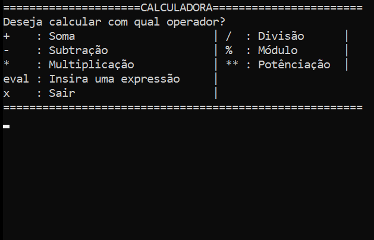
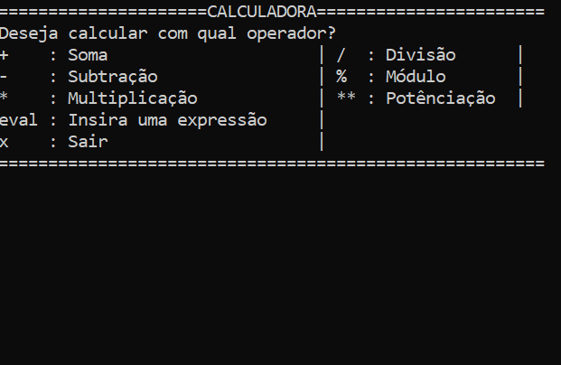

# [ ](https://www.ruby-lang.org) Calculadora com Ruby

Este repositório apresenta o projeto de desenvolvimento de um sistema de calculadora com o auxílio da prática de TDD(Test Driven Development) utilizando a linguagem de programação Ruby e as gems RSpec e pry.

## :page_with_curl: Descrição

O sistema da calculadora torna possível fazer cálculos com operadores básicos, incluindo: ```soma, subtração, multiplicação, divisão, potenciação e módulo.``` Além de possuir a função de realizar expressões mais complexas com o método 'eval' do Ruby, que valida uma expressão em formato String fornecida como argumento.

## :rocket: Começando

### Pré-requisitos
Antes de começar a utilizar a calculadora, é necessário atender os seguintes pré-requisitos:

* :white_check_mark: [Ruby 3.1+](https://www.ruby-lang.org/pt/downloads/)
* :white_check_mark: [Gems RSpec e Pry](calculadora-tdd/Gemfile)
* :white_check_mark: [Git](https://git-scm.com/)
  - Opcional:
* [Cmder](https://github.com/cmderdev/cmder.git)
* [Visual Studio Code](https://code.visualstudio.com/)

### :computer: Instalação
> Se você estiver utilizando o sistema operacional Windows na sua máquina, baixe o instalador do [Ruby](#pré-requisitos) para prosseguir.

Para instalar os pré-requisitos:

* Ruby (Linux/Debian/Ubuntu)
```sh
sudo apt-get install ruby-full
```
* Bundler (Gems)

```sh
gem install bundler
```
Para instalar a calculadora, basta clonar o repositório para o diretório local que desejar.
```sh
git clone https://github.com/RhodrigoLopesPicinini/RealityStone_Rhodrigo_Compass.git
```

## :keyboard: Como usar

* Com um terminal aberto na pasta do arquivo clonado, dentro da pasta ```../calculadora-projeto/```, executar o seguinte comando:

```ruby
ruby Program.rb
```
Demo




* Caso for utilizar os testes da calculadora, executar o arquivo [Gemfile](Gemfile).
```ruby
bundle
```

* Para executar os testes da calculadora, acesse a pasta ```../specs/```, e execute o teste que desejar:

```ruby
rspec {calcular_spec.rb/calcularEval.rb/operadores_spec.rb}
```


## :man_technologist: Autor

Olá, me chamo Rhodrigo e estou cursando Ciência da Computação, este projeto vem do Programa de Bolsas de Automação de testes front-end com Ruby da Compass.UOL, como uma forma de estudar a linguagem Ruby e a prática de TDD.

**Contato:** 
[GitHub](https://github.com/RhodrigoLopesPicinini)
rhodrigolpicinini@hotmail.com 

## Contribuidores


[Compass](https://compass.uol/) - Larissa Campos, Jacques de Jesus Figueredo Schmitz J. e Evelise Teixeira de Freitas

## License

MIT License - veja o arquivo [LICENSE.md](LICENSE.md) para mais detalhes

## Contribuições

Sinta-se livre para clonar este projeto e fazer um fork com suas próprias alterações.

[⬆ Voltar ao topo](#Introdução)<br>